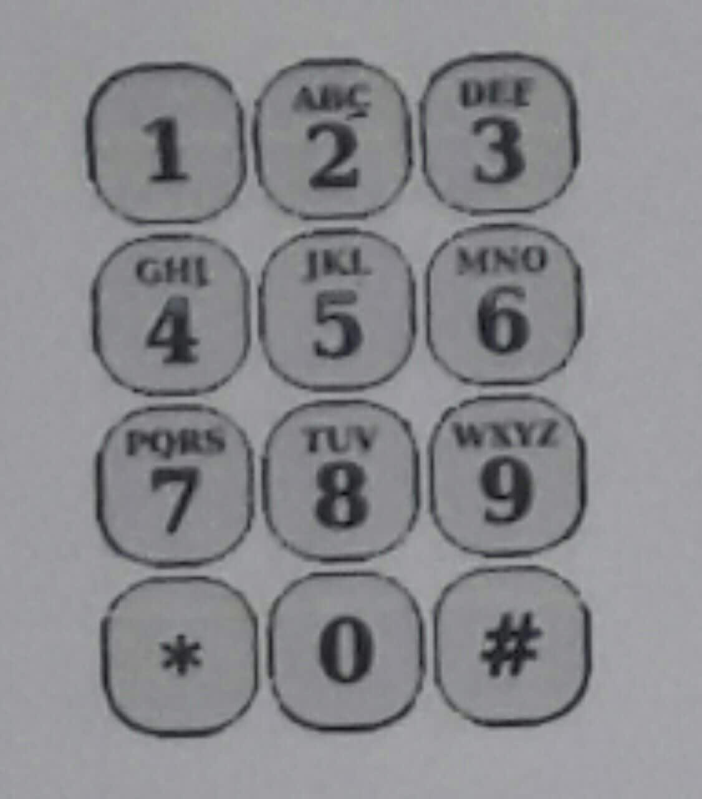
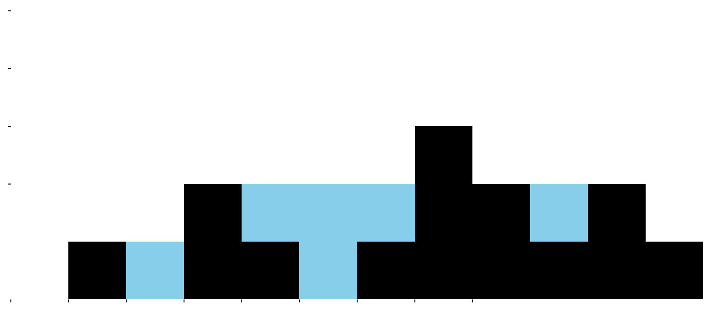

# سوال های مسابقات acm مک
### سوال A1 (مسابقه سیب خوری)

    در شهر کهریزلند مسابقات سیب خوری هرساله با حضور تعدادی از اهالی برگزار میگردد. در مرحله پایانی ۵ شرکت کننده باید در ۱۰ دقیقه هرچقدر که میتوانند سیب بخورند.

    در پایان شرکت کننده ای که بیشترین سیب را بخورد برنده است.

    شهردار کهریزلند از شما میخواهد بعد از پایان مسابقه به او بگویید شرکت کنندگان به ترتیب از کم به زیاد چه تعدادی سیب خورده اند و نفر چندم برنده و نفر چندم از همه کمتر سیب خورده است

</html>

 

<html>

    ورودی ۵ عدد که در یک خط از کاربر دریافت میشود.

    خروجی لیست تعداد سیب هایی که شرکت کنندگان به ترتیب از کم به زیاد خورده اند. در خط دوم شماره کسی که بیشترین سیب را خورده است. در خط سوم شماره کسی که کمترین سیب را خورده است.

 

    نکته: اگر دونفر به مقدار یکسان سیب خوده باشند اولویت با نفری است که شماره ی کوچکتر دارد.

</html>

|       ورودی            |       خروجی           |
|       :---:       |            :---:           |
|    2 18 4 30 32   | 2 4 18 30 32   5   1 |
|    5 16 15 12 2   | 2 5 12 15 16   2   5 |

---
---

### سوال A2 (عدد دانا)

    آقای دانا معلم ریاضی کهریزکند بسیار به دنیای ریاضی و اعداد علاقه مند است. او تصمیم گرفته سبکی از عداد را به نام خود ثبت کند. آقای دانا به اعدادی که از چپ به راست رقم های آن افزایشی است و رقم تکراری درآن وجود ندارد عدد دانا میگوید.

    برنامه ای بنویسید که یک عدد حداکثر ۹ رقمی را دریافت کند و اگر عدد دانا بود ۱ و اگر نبود ۰ را نشان بدهد

|       خروجی      |       ورودی      |
|       :---:       |      :---:      |
|         0         |      12549      |
|         1         |      256789     |
|         1         |     123456789   |

---
---

### سوال A3 (سهمیه مسابقه جهانی)

    آقای دانا معلم ریاضی شهر کهریزلند نوعی آزمون خاص طراحی کرده. و در این آزمون هیچ دونفری نمیتوانند نمره یکسان بگیرند و همچنین هیچکس نمیتواند نمره فرد بگیرد. الی زمانی که تقلب کرده باشند!

    نمره ی این آزمون عددی بین ۰ تا ۱۰۰ است.

    حال آقای دانا از ۵ دانش آموز خود آزمون گرفته است و برای برسی تقلب از شما میخواهد برنامه ای بنویسید که نمرات دانش آموزان را دریافت کند و اگر تقلب کرده بودند ۰ و اگر تقلب نکرده بودند عدد ۱ را در خروجی نمایش دهد.

    ورودی ۵ تا عدد بین ۰ تا ۱۰۰

    خروجی: درصورتی که تقلب کرده اند ۰ و در صورتی که تقلب نکرده اند ۱ در خروجی چاپ شود.

|       خروجی           |       ورودی          |
|       :---:       |           :---:          |
|         0         |      90 40 66 40 20      |
|         1         |      100 60 90 36 24     |
|         0         |      10 73 42 54 24      |

---
---

### سوال B1 (شهرک سازی)

    آقای مالک قصد خرید یک زمین بزرگ n*m را برای شهرک سازی دارد. او به دنبال بهترین زمین برای ساختن شهرک است و از آنجایی که خانه هایی که در مرز شهرک ارزان قیمت تر هستنند. آقای مالک دنبال زمینی با کمترین تعداد ساختمان مرزی است او از شما میخواهد برنامه ای بنویسید که m و n را دریافت کند و بگوید چند ساختمان در این شهرک مرزی خواهند بود.

    برای مثال یک شهرک ۴ در ۳ تعداد ۱۰ ساختمان مرزی هستند.

<table border="1" cellspacing="0" cellpadding="10">
  <tr>
    <td style="background-color: green;">*</td>
    <td style="background-color: green;">*</td>
    <td style="background-color: green;">*</td>
    <td style="background-color: green;">*</td>
  </tr>
  <tr>
    <td style="background-color: green;">*</td>
    <td style="background-color: white;"></td>
    <td style="background-color: white;"></td>
    <td style="background-color: green;">*</td>
  </tr>
  <tr>
    <td style="background-color: green;">*</td>
    <td style="background-color: white;"></td>
    <td style="background-color: white;"></td>
    <td style="background-color: green;">*</td>
  </tr>
  <tr>
    <td style="background-color: green;">*</td>
    <td style="background-color: green;">*</td>
    <td style="background-color: green;">*</td>
    <td style="background-color: green;">*</td>
  </tr>
</table>

|       خروجی       |      ورودی      |
|       :---:      |      :---:       |
|        10        |       4 3        |
|        10        |       2 5        |
|        4         |       2 2        |
|        22        |       7 6        |

---
---

### سوال B2 (تلفن معرفت دایی)

    معرفت دایی یکی از سالمندان کهریزلند است. معرفت دایی همچنان از گوشی دکمه اس خود برای ارتباط استفاده میکند که صفحه کلید آن به این صورت است:

    در این نوع صفحه کلید برای تایپ هر حرف ابتدا باید عدد آن را پبدا کنید سپس اگر حرف مد نظر شما حرف اول بود یک کلیک اگر حرف دوم بود دو کلیک اگر حرف سوم بود سه کلیک و اگر حرف چهارم وجود داشت چهار بار باید کلیک کنید و اگر کاراکتر فاصله را میخواستید تایپ کنید باید یکبار روی ۱ کلیک کنید. همچنین برای تایپ خود عدد در دکمه های ۳ حرفه به ۴ کلیک و در های چهار حرفه به ۵ کلیک برای تایپ ۰ یک بار روی کلید صفر و برای تایپ ۱ باید دوبار روی کلید یک کلیک کنید. حرف * و # یک بار باید فشرده شود.

    برای مثال برای تایپ حرف S شما باید ۴ بار روی دکمه ی هفت کلیک کنید.

    معرفت دایی از آنجایی که دیگر انرژی ای برایش باقی نمانده تصمیم دارد قبل از ارسال پیام بداند که برای نوشتن آن به چند کلیک نیاز دارد که اگر تعداد کلیک ها از میزان اهمیت پیام بیشتر بود آن را تایپ نکند.

    حال شما برنامه ای بنویسید که در خط اول ورودی متن پیام و در خط دوم میزان اهمیت پیام (یک عدد بین ۵ تا ۱۰۰۰) را دریافت کند. و اگر تعداد کلیک های مورد نظر از اهمیت پیام کمتر بود ۱ و اگر بیشتر بود ۰ را چاپ کند و همچنین اگر کاراکترب وجود داشت که معرفت دایی نمیتوانست آن را چاپ کند و یا اهمیت پیام در بازه ی مد نظر نبود error را در خروجی چاپ کند.

    ورودی: یک متن حداکثر ۳۰ کاراکتری و در خط بعد یک عدد بین ۵ تا ۱۰۰۰

    خروجی: عدد ۰ یا ۱ و یا در صورت نبودن کاراکتر error

|       خروجی        |        ورودی                |
|       :---:        |        :---:                |
|        1           |   salam mok   100        |
|        error       |   acm mok $ cup   100    |
|        0           |       mok2404   15       |

---
---

### سوال B3 (مسابقات تیر اندازی کهریزلند)

    در کهریزلند n نفر شرکت کننده در مسابقات تیر اندازی شرکت کرده اند. هر نفر باید با تمامی شرکت کنندگان مسابقه دهد.

    با توجه به تعداد شرکت کنندگان مشخص کنید که چند مسابقه برگزار خواهد شد؟

    ورودی: یک عدد چهار رقمی که مجموع ارقام آن تعداد شرکت کنندگان را مشخص میکند.

    خروجی: یک عدد که تعداد دفعات مسابقه را نشان میدهد

|       خروجی       |      ورودی      |
|       :---:      |      :---:       |
|        15        |       1212       |
|        6         |       1111       |
|        1         |       1001       |
|        45        |       4123       |

---
---

### سوال C1 (بازی شطرنج)

    در شهر کهریزلند بازی شطرنج از بازی های محبوب میباشد. اما بازی شطرنج آنها فقط دارای مهره وزیر است. بازی به این صورت است که آنها ۶ وزیر دارند. شروع کننده ۵ وزیر را در صفحه شطرنج قرار میدهد و حریف باید در کمتر از ۵ ثانیه وزیر ششم را طوری قرار دهد که هیچ کدام از آن ۵ وزیر حریف نتوانند آنرا بزند. علی که بسیار علاقه مند به این رشته است برای اینکه تمرینات زیادی داشته باشد از شما میخواهد که برنامه ای بنویسید که مختصات ۵ وزیر را دریافت کرده و خانه هایی که میتوانید وزیر ششم را در آنها قرار دهید مشخص کنید.

    ورودی: ۱۰ عدد که به ترتیب مختصات x و y وزیر اول تا پنجم است.

    خروجی: یک عدد که تعداد خانه هایی که میتوان وزیر ششم را در آن ها قرار داد نشان دهید.

|       خروجی       |      ورودی      |
|       :---:      |      :---:       |
|        15        |       0 0   1 1   2 2   3 3   4 4    |
|        6         |       7 0   2 1   3 1   5 1   4 2    |

---
---

### سوال C2 (جمع آوری آب)

    در گوشه کنار کهریزلند کوه های سنگی کوچک و بزرگی وجود دارد. معمولا بعد از باران بین چاله ها و گودی های این کوهستان آب جمع میشود.

    سینا که بسیار به حفظ محیط زیست علاقه دارد قصد دارد آبی که بعد از هر بار بارش باران در این چاله ها جمع میشود را جمع آوری کند و به گلخانه ی خودش ببرد. اما از آنجایی که دقیق بودن برای سینا خیلی مهم است قصد دارد که مقدار دقیق این آب را قبل از جمع آوری بداند.

    برنامه ای بنویسید که با دریافت ارتفاع کوهستان بگوید کل حجم مقدار آب جمع شده در این کوهستان چقد میتواند باشد.

    ورودی: ۱۲ عدد بین ۰ تا ۵ که نشاندهنده ی ارتفاع آن منطقه است.

    خروجی: کل حجم آب جمع آوری شده بعد از باران.

    مثال ورودی: 1 2 1 2 3 1 0 1 2 0 1 0

|       خروجی       |      ورودی      |
|       :---:      |      :---:       |
|        6         |       0 1 0 2 1 0 1 3 2 1 2 1    |
|        11        |       3 1 2 1 4 1 1 4 1 1 1 1    |

---
---

### سوال C3 (دزد باهوش)

    در کهریزلند همه خانه ها مجهز به سیستم دزدگیر هوشمند هستند. بطوری که اگر از دو خانه ی همسایه دزدی شود دزدگیر به صدا در می آید و پلیس خبر دار میشود!

    آقای دزدادیان قصد دارد شبانه به کوچه "باغ سبز" برود و دزدی کند!

    در این کوچه ۱۰ خانه وجود دارد که هر خانه یک ارزش از ۱ تا ۱۰ دارد. برنامه ای بنویسید که ارزش این ۱۰ خانه را دریافت کند و در خروجی بیشترین سود ممکن برای آقای دزدادیان را بگونه ای که دزدگیری به صدا در نیاید مشخص کند.

|      خروجی       |      ورودی      |
|       :---:     |      :---:       |
|        26       |       3 8 2 4 1 3 7 6 5 5    |
|        32       |       1 5 10 2 6 9 7 1 4 8   |
|        7        |       1 1 2 1 1 2 1 1 2 1    |